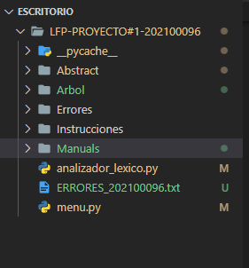
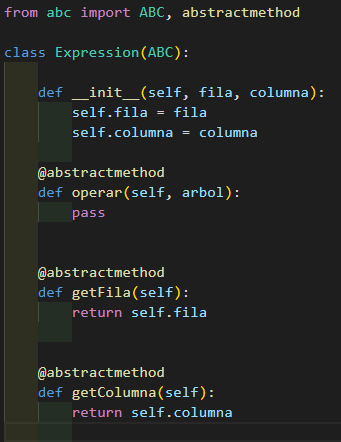
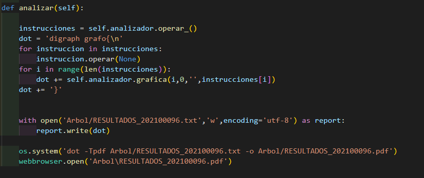
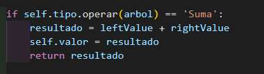
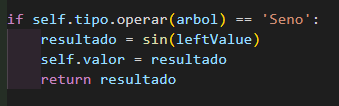
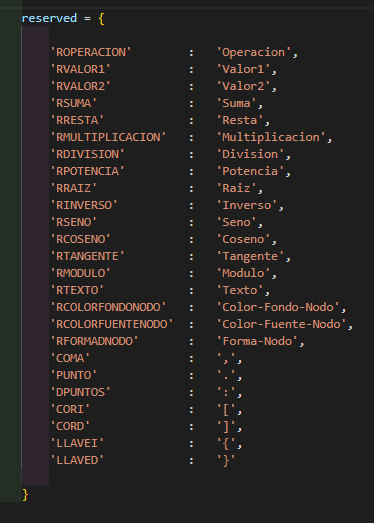
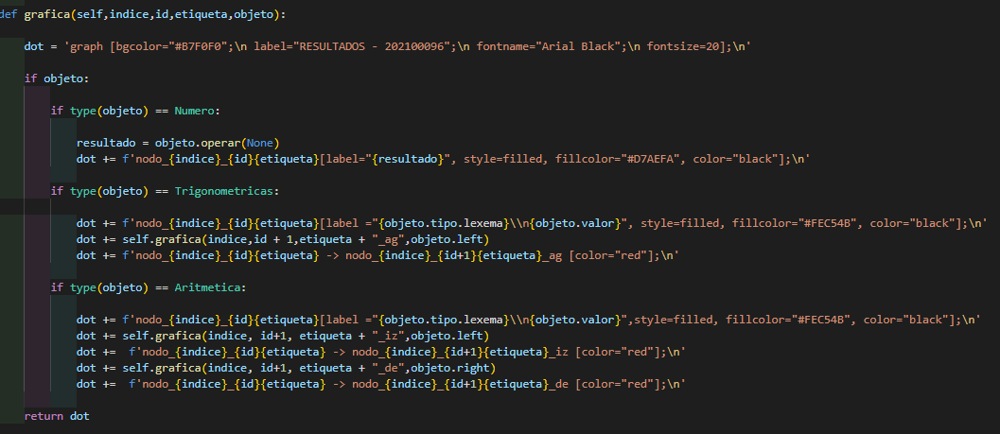
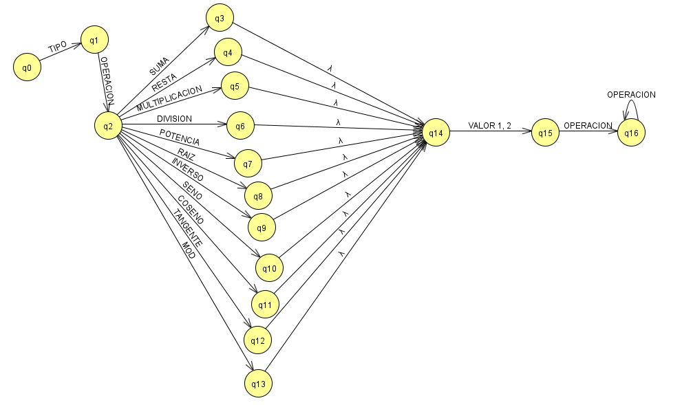

 

    
    

# UNIVERSIDAD DE SAN CARLOS DE GUATEMALA

## MANUAL TÉCNICO

|**CARNET**  |      **NOMBRE COMPLETO**          |  
|----------|:-----------------------------------:|
|202100096 |  RIVER ANDERSON - ISMALEJ ROMAN     |    
|CURSO     | LENGUAJES FORMALES DE PROGRAMACION  | 
| AUXILIAR |   DIEGO ANDRÉS - OBÍN ROSALES       |   
| SECCION  |                B+                   |    
- - -

* Para la creacion de este Proyecto 1, se realizo un analizador léxico el cual identifica los caracteres no admitidos en la lectura del archivo. Para esto proyecto se uso el metodo de Recursividad, Abstracion y de igual formal se crearon multiples carpetas para obtener un mejor orden en el desarrollo del programa.

---
### **Abstract**

* En la carpeta Abstract encontraremos 3 archivos en formato .py el cual uno se llama Abstract que contiene el metodo Abstracto para la realizacion de las operaciones.

* Luego tenemos un documento llamado lexema que esta se encarga de heredar la clase abstracta Expression y el constructor toma un lexema, una fila y una columna, lo mismo sucede con numero.py el cual representa una clase en el árbol de expresiones.

---

### **Árbol**

* En la carpeta arbol se genera el pdf desde la gui del programa al presional analizar, este generará un archivo en formato pdf* el cual contiene el arbol de las operaciones realizadas.

* Se utilizo la libreria os para poder abrir el archivo directamente en un navegador web.

---

### **Instrucciones**

* En instrucciones contamos con 2 documentos el cual, uno se llama aritmeticas dentro de ella se usa el metodo Abstracto con la clase Expression el cual se declara una fila, columna, tipo, left y right en este caso estos nos servirán para poder identificar el lado derecho e izquierdo para la realizacion de las operacion y estos nos servirá para la construccion del arbol. Dentro de Aritmeticas se indican las operaciones que se realizarán en este caso tenemos: Suma, Resta, Multiplicacion, Division, Raiz, Potencia, Modulo.

* Seguidamente tenemos Trigonometricas.py el cual nos ayuda a la realizacion de operaciones trigonometricas como seno, coseno y tangente estos tambien contiene los parametros de fila, columna, tipo, left.

---

### **Manuals**

* Dentro de la carpeta encontraremos los manuales de usuario y tecnico, que fueron elaborados en formato markdown.

---

### **Analizador Lexico**

* Para la creacion del analizador lexico, primero creamos un diccionario de palabras reservadas.

* Luego de eso creamos una clase Instruccion que se encarga de tomar la cadena que creamos y este devuelve la lista de tokens, y la lista de lexemas.

* Luego contamos una clase armar_lexema el cual nos ayuda a formar nuestros lexemas

* Luego en armar_numero lo que realiza es que toma la cadena la analiza y este revisa si un numero entero o un numero decimal.

* Luego llegamos en Operar el cual este lo que realiza es tomar una lista de tokens y devuelve el arbol de nodos que representan tanto la expresion aritmeticas y trigonometricas.

---

### **Arbol**

* Para la creacion del Árbol utilizamos el siguiente codigo: 

* Este lo que hace es poder indentificar los nodos, recordemos que los nodos tienen un principal, luego un hijo izquierdo y un hijo derecho, entonces acá los separamos y juntamos los nodos para poderlos graficar en nuestra documento de menu.py para que al darle clik en analizar este nos arroje el arbol creado con las operaciones correspondientes.

* Automata

