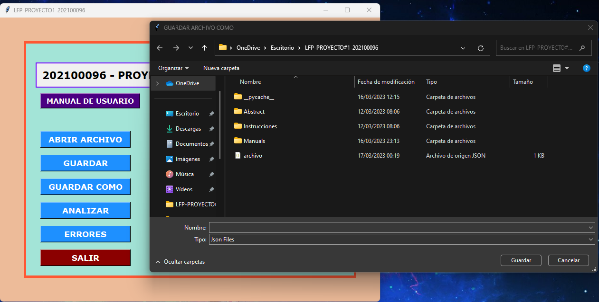

 

    
    

# UNIVERSIDAD DE SAN CARLOS DE GUATEMALA

## MANUAL DE USUARIO 

|**CARNET**  |      **NOMBRE COMPLETO**          |  
|----------|:-----------------------------------:|
|202100096 |  RIVER ANDERSON - ISMALEJ ROMAN     |    
|CURSO     | LENGUAJES FORMALES DE PROGRAMACION  | 
| AUXILIAR |   DIEGO ANDRÉS - OBÍN ROSALES       |   
| SECCION  |                B+                   |    
- - -

### **ACERCA DEL PROGRAMA**
* Se creo una herramienta capaz de reconocer un lenguaje, dado por medio de un analizador lexico el cual contiene ciertas reglas, manejando una estructura y escritura de archivos para el manejo de la informacion usando un entorno gráfico.

### **OBJETiVOS ESPECIFICOS**
* Implementar un analizador lexico.
* Utilizar funciones de manejo de cadenas de caracteres en el lenguaje Python.
* Programar un Scanner para el Anáslis Léxico.
* Crear una interfaz grafica usando Tkinter para la interaccion del usuario.

---
>###  **PANTALLA INICIAL**
* En la pantalla inicial podremos encontrar las diferentes opciones que contiene el programa, se recomienda comenzar en Abrir Archivo el cual nos permite poder cargar un archivo al programa el formato del archivo debe ser en *txt.

---
>### **ABRIR ARCHIVO**
* Al presionar Abrir Archivo este nos desplegara una ventana de Tkinter para poder cargar o abrir un archivo de *txt su contenido se imprimirá en la cajita de texto.

---
>### **GUARDAR**

* Al tener cargado un archivo este se muestra en la cajita de texto, si se llega a modificar el texto que contiene la cajita y presionamos guardar este guardará los cambios realizados en el archivo.

---
>### **GUARDAR COMO**
* Al presionar el boton Guardar Como nos guarda un nuevo archivo nosotros podremos elegir el nombre que le queremos colocar al archivo, se recomienda realizar esta accion si el archivo que fue cargado y este fue modificado en la cajita de texto, y queremos guardarlo como un nuevo archivo.

---

>### **ANALIZAR**
 * Al presionar Analizar este genera un archivo en formato PDF, que se abrirá directamente al navegador para poder visualizar las gráficas de las operaciones.(Se mostrará el árbol de operaciones)

---

>### **ERRORES**

* En este apartado se genera un archivo en formato *txt con los errores que se recopilaron este mostrará la fila y columna donde se encuentra el error.

---

>### **SALIR**

* Al presionar salir este cerrará el programa completamente.

---

>### **MANUAL DE USUARIO**

* Al presionar Manual de Usuario se redireccionará al Usuario al navegador con un pestaña de Github donde podremos visualizar la nformacion sobre la guia de como usar el programa. (El Manual de Usuario fue elaborado en formato MarkDown).

---

>### **MANUAL TÉCNICO**

* Al presionar Manual Técnico se redireccionará al Usuario al navegador con un pestaña de Github donde podremos visualizar la Informacion Técnica sobre la guia de como fue elaborado el programa de como fue construido el analizador lexico, el AFD para el método del Árbol. (El Manual Técnico fue elaborado en formato MarkDown).

--- 

>### **AYUDA**
* Al presionar el botón de Ayuda, este nos brindara informacion del estudiante quien desarrollo el programa.

